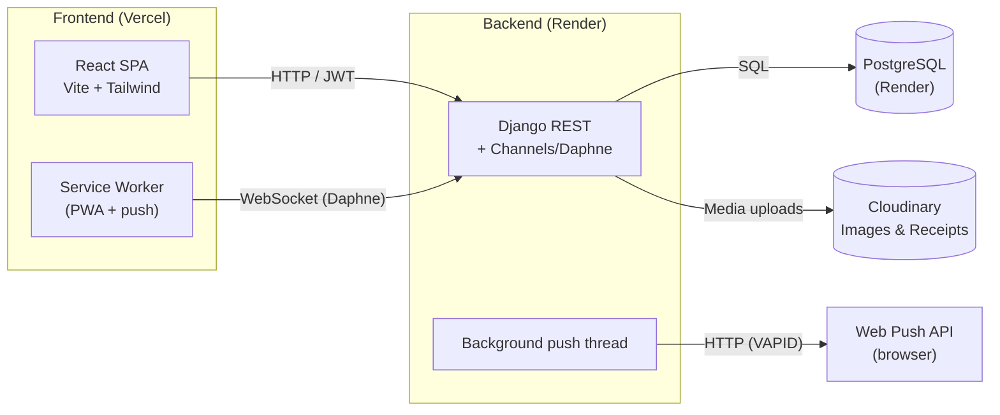
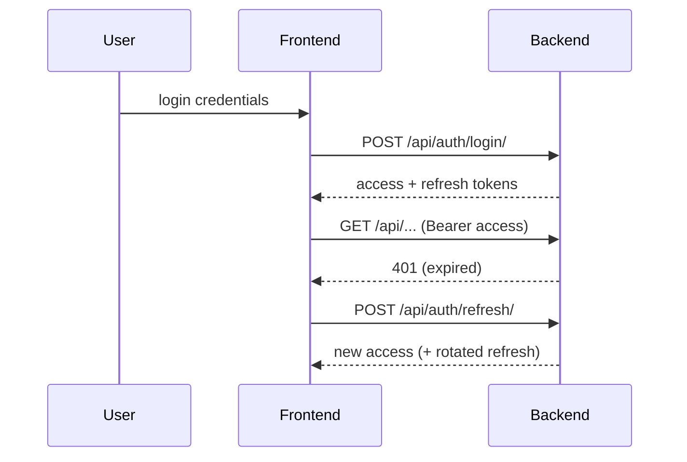
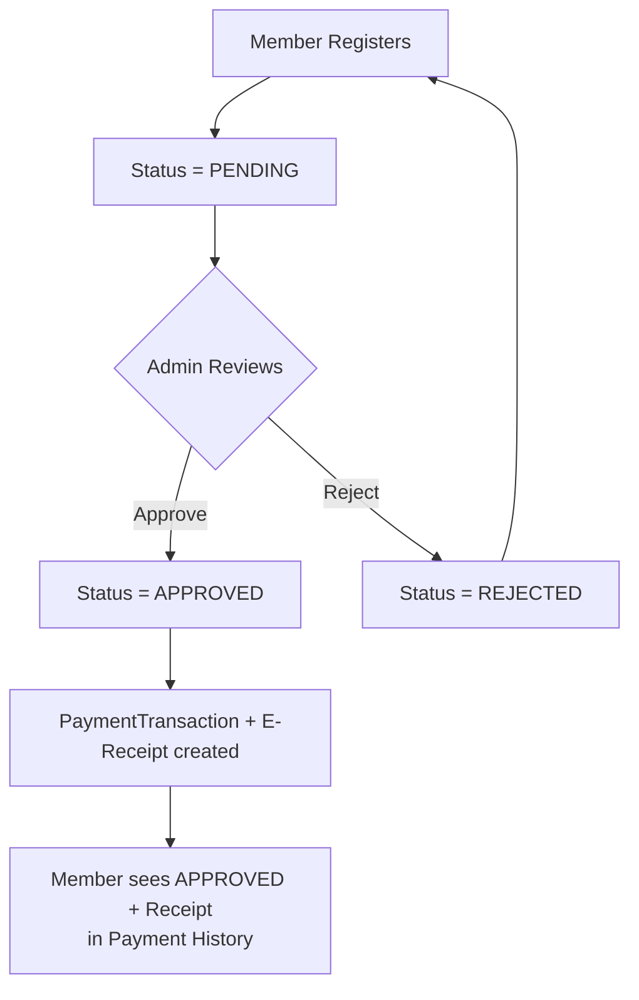

---
title: Architecture
description: System architecture, auth flow, and permissions
---

# Architecture

## High-Level Diagram



> The backend talks to **Cloudinary** for image/document uploads, and fires **Web Push** notifications to subscribed browsers using VAPID keys.

## Authentication Flow

1. User submits credentials via `POST /api/auth/login/` or `POST /api/auth/admin-login/`
2. Backend validates credentials and returns JWT **access** (15 min) and **refresh** (7 days) tokens
3. Frontend stores tokens in `localStorage` (access) and keeps the refresh token (rotated on refresh)
4. Every API request includes `Authorization: Bearer <access_token>`
5. When the access token expires, the frontend calls `POST /api/auth/refresh/` to get a new one
6. Tokens are cleared on logout; refresh tokens are blacklisted on rotation



## Role Hierarchy

```
ADMIN --> OFFICER --> MEMBER
```

- **ADMIN**: Full system access, can manage other admins
- **OFFICER**: Administrative access with assigned position
- **MEMBER**: Can view profile, renew, see announcements

## Permission Matrix

| Access Level | Members CRUD | Announcements CRUD | Achievements CRUD | Admins CRUD | Own Profile |
|---|---|---|---|---|---|
| **FULL_CONTROL** | Yes | Yes | Yes | Yes | Yes |
| **MEMBERSHIP** | Yes | Yes | Yes | No | Yes |
| **RESTRICTED** | No | No | No | No | Yes |

> **Note**: The **President** position always has FULL_CONTROL regardless of their `access_level` field.

## Data Flow: Registration → Approval → Receipt



## Directory Structure

```
icpep_portal/
├── backend/
│   ├── members/           # Member management app
│   │   ├── views.py       # API views
│   │   ├── serializers.py # DRF serializers
│   │   ├── models.py      # Data models
│   │   ├── receipt_generator.py  # E-receipt generation
│   │   └── urls.py        # URL routing
│   ├── announcements/     # Announcements app
│   ├── users/             # Admin/officer management
│   ├── permissions.py     # Custom permissions
│   └── icpep_backend/     # Project settings
├── frontend/
│   ├── src/
│   │   ├── pages/         # React page components
│   │   ├── components/    # Shared components
│   │   ├── context/       # React contexts
│   │   └── App.jsx        # Root component
│   └── public/            # Static assets
├── pages/                 # This documentation (Mintlify)
├── docs/                  # Docs dev wrapper (npm)
└── images/                # Doc assets
```
