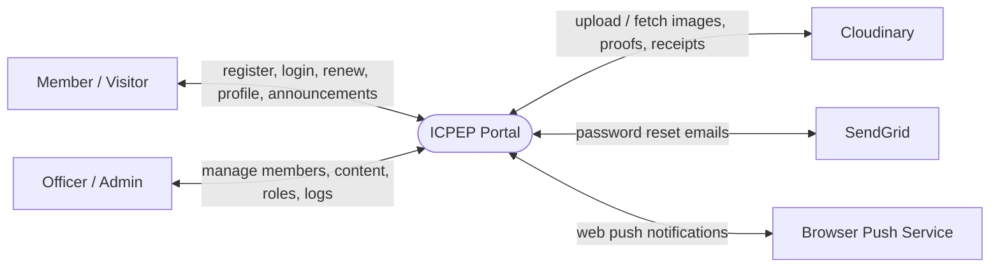
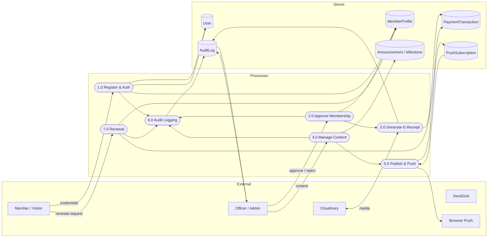
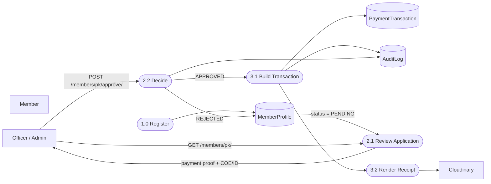
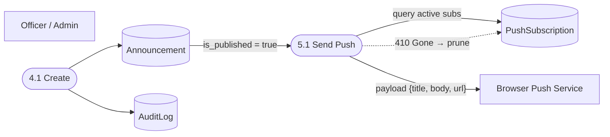

# Data Flow Diagram (DFD)

This page documents the ICPEP Portal using classic DFD notation — useful for academic review and for the next-generation maintainers to see where every piece of data enters and leaves the system.

**Legend for the diagrams below:**

| Shape | Meaning |
|---|---|
| `[ Rectangle ]` | External entity (person or system outside the portal) |
| `([ Rounded ])` | Process (transform of data) |
| `[( Cylinder )]` | Data store (persistent data) |

## Context Diagram (Level 0)

The portal is a single system exchanging data with five external entities: **Member/Visitor**, **Officer/Admin**, **Cloudinary** (media), **SendGrid** (email), and the **Browser Push Service**.

## Level-1 DFD

### Process list

| # | Process | Description | Data stores read/written |
|---|---|---|---|
| 1.0 | Register & Auth | Registration, login, admin-login, JWT refresh | User, MemberProfile |
| 2.0 | Approve Membership | Admin approval/rejection of member application | MemberProfile, AuditLog |
| 3.0 | Generate E-Receipt | Pillow PNG receipt on approval | PaymentTransaction, Cloudinary |
| 4.0 | Manage Content | Announcements + milestones CRUD, reorder | Announcement/Milestone, AuditLog |
| 5.0 | Publish & Push | Publish announcement → background web push to subscriptions | Announcement, PushSubscription |
| 6.0 | Audit Logging | `log_action()` records every privileged change | AuditLog |
| 7.0 | Renewal | Member renews expired/rejected membership | MemberProfile, PaymentTransaction |

## Level-2 DFD: Membership Approval

## Level-2 DFD: Announcement Publishing + Push

> **Push behavior note:** push fires only at **creation** (`perform_create`), when `is_published=True`. Re-publishing an existing draft does not re-trigger a push.
