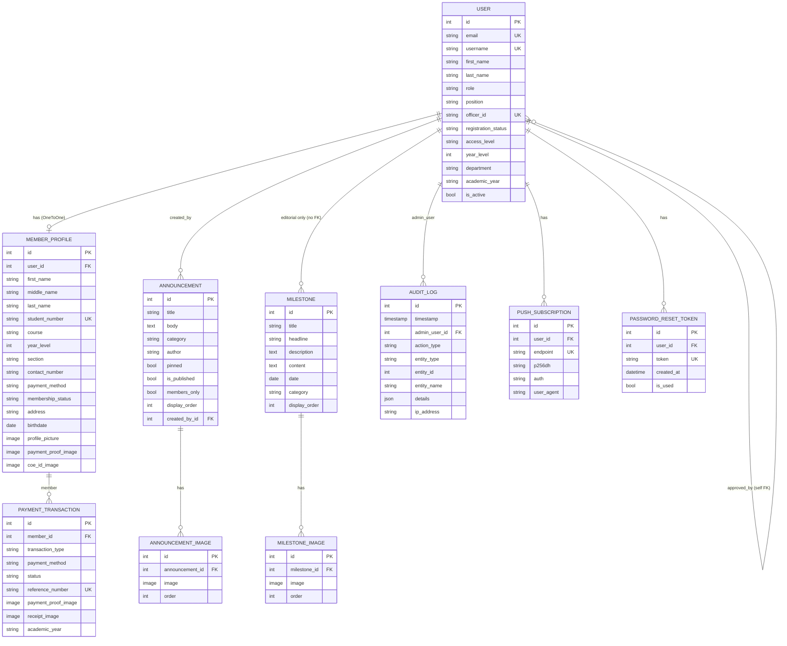

# Data Model

The backend lives under `backend/` and is organized into Django apps. Each app owns its models (`models.py`). The custom user model is `users.User` (`AUTH_USER_MODEL = 'users.User'`).

## Entity Relationship Diagram

## Data Dictionary

### `users.User` (`backend/users/models.py`)

Custom auth model. `USERNAME_FIELD = 'email'`, `REQUIRED_FIELDS = ['username']`.

| Field | Type | Notes |
|---|---|---|
| `email` | CharField, unique | Login identifier |
| `username` | CharField, unique | Display handle |
| `first_name` / `last_name` | CharField | — |
| `role` | CharField | `ADMIN` / `OFFICER`; members stored as `'MEMBER'` (not a declared choice) |
| `position` | CharField | e.g. "President", "Treasurer"; `'NONE'` = no active term |
| `officer_id` | CharField, unique | Auto-generated `ICPEP-0001`… in `save()` |
| `registration_status` | CharField | `PENDING` / `APPROVED` / `REJECTED` |
| `access_level` | CharField | `FULL_CONTROL` / `MEMBERSHIP` / `RESTRICTED` |
| `year_level` | CharField | `'1'`–`'4'` |
| `department`, `academic_year` | CharField | Officer context |
| `term_start` | DateField | Officer term start |
| `display_order` | IntegerField | Roster ordering |
| `approved_by` | FK → self (SET_NULL) | Who approved this admin request |
| `requested_position`, `requested_department`, `requested_academic_year`, `admin_note` | — | Stored when an officer requests admin access |
| `must_change_password` | BooleanField | Forced password change |

**Key properties:** `is_admin`, `is_term_active`, `is_term_expired`, `has_payment_access` (president/finance/treasurer), `has_approval_access` (president/vice president/secretary), `can_manage_roles` (President always + ADMIN + FULL_CONTROL), `can_add_announcements`, `assignable_positions()`.

### `members.MemberProfile` (`backend/members/models.py`)

| Field | Type | Notes |
|---|---|---|
| `user` | OneToOne → User (CASCADE) | `related_name='profile'` |
| `first_name`, `middle_name`, `last_name` | CharField | — |
| `student_number` | CharField, unique | e.g. `2024-73359` |
| `course` | CharField | — |
| `year_level` | IntegerField | 1–4 |
| `section` | CharField | A/B/C/D suggestions in UI |
| `contact_number` | CharField | 11 digits starting with `09` |
| `payment_method` | CharField | `ON_HAND` / `GCASH` |
| `payment_proof_image` | ImageField | `payment_proofs/` |
| `coe_id_image` | ImageField | `coe_id_documents/` |
| `address`, `birthdate` | Char/Date | Optional profile fields |
| `profile_picture` | ImageField | `profiles/` |
| `admin_message` | TextField | Shown to member on reject/approve |
| `membership_status` | CharField | `PENDING` / `APPROVED` / `REJECTED` / `EXPIRED` (default PENDING) |

### `members.PaymentTransaction`

| Field | Type | Notes |
|---|---|---|
| `member` | FK → MemberProfile (CASCADE) | `related_name='transactions'` |
| `transaction_type` | CharField | `REGISTRATION` / `RENEWAL` |
| `payment_method` | CharField | `ON_HAND` / `GCASH` |
| `payment_proof_image` | ImageField | `payment_proofs/` |
| `receipt_image` | ImageField | `receipts/` — generated on approval |
| `status` | CharField | `PENDING` / `VERIFIED` |
| `reference_number` | CharField, unique | `ICPEP-YYYY-NNNN` |
| `academic_year` | CharField | e.g. `2026-2027` |
| `approved_by_name` | CharField | Free text name of approving admin |

### `members.PaymentSettings`

Singleton (id=1): `gcash_number`, `gcash_name`, `updated_at`. Edited by President/Treasurer.

### `announcements.Announcement` + `AnnouncementImage`

| Field | Notes |
|---|---|
| `title`, `body` | Content |
| `category` | `announcement` / `achievement` / `update` / `opportunity` / `event` |
| `author` | Free text, default `'Admin'` |
| `pinned`, `is_published`, `members_only` | Visibility flags |
| `display_order` | Reorderable |
| `created_by` | FK → User (SET_NULL) |
| `AnnouncementImage` | `announcement` FK (CASCADE), `image`, `order` |

### `milestones.Milestone` + `MilestoneImage`

| Field | Notes |
|---|---|
| `title`, `headline`, `description`, `content` | Content |
| `date` | Timeline date |
| `category` | `founding` / `achievement` / `recognition` / `event` / `community` / `feature` |
| `display_order` | Reorderable |
| `MilestoneImage` | `milestone` FK (CASCADE), `image`, `order` |

### `audit_logs.AuditLog`

| Field | Notes |
|---|---|
| `timestamp` | `auto_now_add`, indexed |
| `admin_user` | FK → User (SET_NULL) |
| `action_type` | 22 choices (see enums) |
| `entity_type` | `Member` / `User` / `Milestone` / `Announcement` / `PaymentSettings` |
| `entity_id` | Loose integer ref (no FK constraint, polymorphic) |
| `entity_name`, `details` (JSON), `ip_address` | Context |

### `push.PushSubscription`

`user` (FK, CASCADE), `endpoint` (unique URL), `p256dh`, `auth`, `user_agent`, timestamps. One per device/browser.

### `authentication` models

- `FailedLoginAttempt` — `email` (indexed), `ip_address`, `created_at`; used for the 5-failure / 15-min block.
- `PasswordResetToken` — `user` (FK, CASCADE), `token` (unique, 128), `created_at`, `is_used`; expires after 24h.

## Status Enums (Quick Reference)

| Enum | Values |
|---|---|
| `User.role` | `ADMIN`, `OFFICER` (members: `'MEMBER'` string) |
| `User.registration_status` | `PENDING`, `APPROVED`, `REJECTED` |
| `User.access_level` | `FULL_CONTROL`, `MEMBERSHIP`, `RESTRICTED` |
| `MemberProfile.membership_status` | `PENDING`, `APPROVED`, `REJECTED`, `EXPIRED` |
| `PaymentTransaction.transaction_type` | `REGISTRATION`, `RENEWAL` |
| `PaymentTransaction.payment_method` | `ON_HAND`, `GCASH` |
| `PaymentTransaction.status` | `PENDING`, `VERIFIED` |
| `Announcement.category` | `announcement`, `achievement`, `update`, `opportunity`, `event` |
| `Milestone.category` | `founding`, `achievement`, `recognition`, `event`, `community`, `feature` |
| `AuditLog.entity_type` | `Member`, `User`, `Milestone`, `Announcement`, `PaymentSettings` |
| `AuditLog.action_type` | `MEMBER_APPROVED/REJECTED/CREATED/UPDATED/DELETED`, `ROLE_ASSIGNED`, `ADMIN_CREATED/UPDATED/DELETED`, `MILESTONE_CREATED/UPDATED/DELETED`, `MILESTONE_IMAGE_UPLOADED/DELETED`, `ANNOUNCEMENT_CREATED/UPDATED/DELETED`, `ANNOUNCEMENT_IMAGE_UPLOADED/DELETED`, `YEAR_END_RESET`, `PAYMENT_SETTINGS_UPDATED` |

## Notable Constraints & Quirks

- `MemberProfile.user` uses a custom FK constraint (migration `0006_fix_memberprofile_user_fk`, deferred / NOT VALID).
- `AuditLog.entity_id` is a loose integer — no referential integrity; entity may be deleted.
- Member registrations created via `RegisterSerializer` do **not** set `role` explicitly → members get the model default; `MemberCreateSerializer` (admin-created) sets `role='MEMBER'`.
- The `ROLE_DELEGATED` action is a declared choice but the delegation feature was removed (migration 0016).
