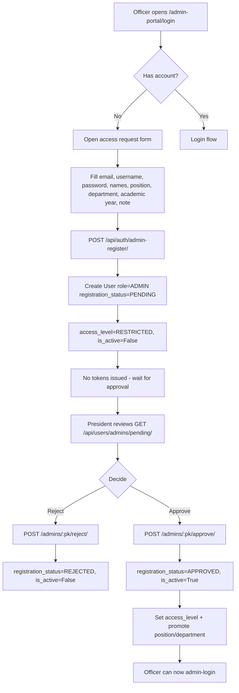

# Admin Access Request Flow

## Flowchart

## Step-by-Step

1. An officer navigates to the hidden admin portal login (`/admin-portal/login`, reached via the **5-tap logo gesture** on the landing page) and opens the **request access** form.
2. They submit their details plus requested position, department, academic year, and a note.
3. `POST /api/auth/admin-register/` (AllowAny, 5/min) creates a `User` with:
   - `role='ADMIN'`, `position=''` (blank until approved)
   - `registration_status='PENDING'`, `access_level='RESTRICTED'`, `is_active=False`
   - requested fields + `admin_note` stored
   - **No JWT tokens are issued** — the response tells them to wait for the President.
4. The President reviews the list via `GET /api/users/admins/pending/`.
5. **Approve** (`POST /api/users/admins/<pk>/approve/`): sets `APPROVED`, `is_active=True`, applies the requested access level (default RESTRICTED; valid `FULL_CONTROL`/`MEMBERSHIP`/`RESTRICTED`), promotes the requested position/department/academic year, and records `approved_by`/`approved_at`.
6. **Reject** (`POST /api/users/admins/<pk>/reject/`): sets `REJECTED`, `is_active=False`, clears position.
7. No email is sent either way — the officer learns the result at the next `admin-login` attempt, which returns distinct messages (still pending / rejected / term ended / disabled).

## Alternate paths

- The **President** can bypass the request flow entirely and directly create an officer via `POST /api/users/admins/create/` (President-only).
- Role changes (including transferring the presidency — the old President is demoted to `position='NONE'`) go through `PATCH /api/users/admins/<pk>/assign-role/` (full-control).

## API Endpoints

| Endpoint | Method | Permission | Purpose |
|---|---|---|---|
| `/api/auth/admin-register/` | POST | AllowAny (5/min) | Officer access request |
| `/api/users/admins/pending/` | GET | IsAuthenticated + can_manage_roles | List pending requests |
| `/api/users/admins/<pk>/approve/` | POST | can_manage_roles | Approve request |
| `/api/users/admins/<pk>/reject/` | POST | can_manage_roles | Reject request |
| `/api/users/admins/create/` | POST | President only | Direct officer creation |
| `/api/users/admins/<pk>/assign-role/` | PATCH | full-control | Role/position changes |

## Related Pages

- [Screens: Admin Login](/screens/admin-login)
- [Flow: Auth & Sessions](/flows/auth-session)
- [Admin Guide: Officers](/admin-guide/officers)
