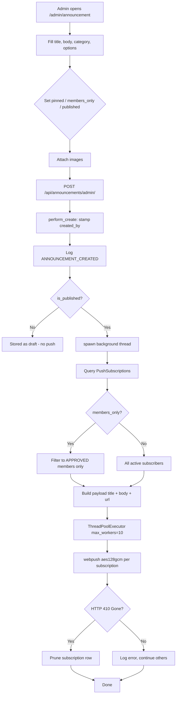

# Announcements & Push Notifications Flow

## Flowchart

## Step-by-Step

1. An admin opens the announcement manager and fills in the **title**, **body**, **category** (`announcement`, `achievement`, `update`, `opportunity`, `event`), and options (pinned, published, members-only).
2. Optional images are attached (uploaded per-announcement via the images endpoints).
3. `POST /api/announcements/admin/` (CanManageContent) creates the record; `perform_create` stamps `created_by` and the `author` fallback.
4. `ANNOUNCEMENT_CREATED` is written to the audit log.
5. **Only if `is_published=True`** at creation time, a **background thread** (`push/services.py::send_announcement_push`) is spawned so the HTTP request isn't blocked.
6. The sender queries all `PushSubscription` rows; if `members_only`, it restricts to members with `membership_status='APPROVED'`.
7. Each subscription gets a payload `{ title, body (first 120 chars), url: <FRONTEND_URL>/announcement/<id>, icon/badge }`, delivered with **`aes128gcm`** content encoding via `pywebpush`.
8. Sending uses a `ThreadPoolExecutor(max_workers=10)`. Errors are logged and swallowed per device (one bad device never breaks the broadcast); **HTTP 410 → the subscription row is pruned** (device unsubscribed).
9. The frontend's service worker shows the custom **title/body** and opens `/announcement/<id>` on click.

## Key behaviors & caveats

- Push fires **only on creation** when `is_published=True`. Re-publishing a draft or toggling publish does **not** re-send.
- `members_only` gating on the public API is a **query-param** filter (`?include_members_only=1`) on an `AllowAny` endpoint — there is no hard server-side auth gate.
- Update/delete publish window events (`announcementUpdated` / `announcementDeleted`) so the public feed and member list refresh in real time.
- Without `VAPID_PUBLIC_KEY`/`VAPID_PRIVATE_KEY` in the backend env, `GET /api/push/vapid-key/` returns **503** and nothing can be sent.

## API Endpoints

| Endpoint | Method | Permission | Purpose |
|---|---|---|---|
| `/api/announcements/` | GET | AllowAny | Public feed (published only) |
| `/api/announcements/admin/` | GET/POST | IsAdmin / CanManageContent | List / create |
| `/api/announcements/admin/<id>/` | GET/PUT/PATCH/DELETE | IsAdmin / CanManageContent | Manage one |
| `/api/announcements/admin/reorder/` | POST | CanManageContent | Reorder by `display_order` |
| `/api/announcements/admin/<id>/images/` | POST | CanManageContent | Upload images |
| `/api/announcements/admin/images/<image_id>/` | DELETE | CanManageContent | Delete image |
| `/api/push/vapid-key/` | GET | AllowAny | Public VAPID key (503 if unconfigured) |
| `/api/push/subscribe/` | POST | IsAuthenticated | Save device subscription |
| `/api/push/unsubscribe/` | POST | IsAuthenticated | Remove subscription |

## Related Pages

- [Screens: Admin Announcement](/screens/admin-announcement)
- [Screens: Member Announcements](/screens/member-announcements)
- [Data Flow: Announcement Publishing](/data-flow-diagram)
- [Data Model: PushSubscription](/data-model)
