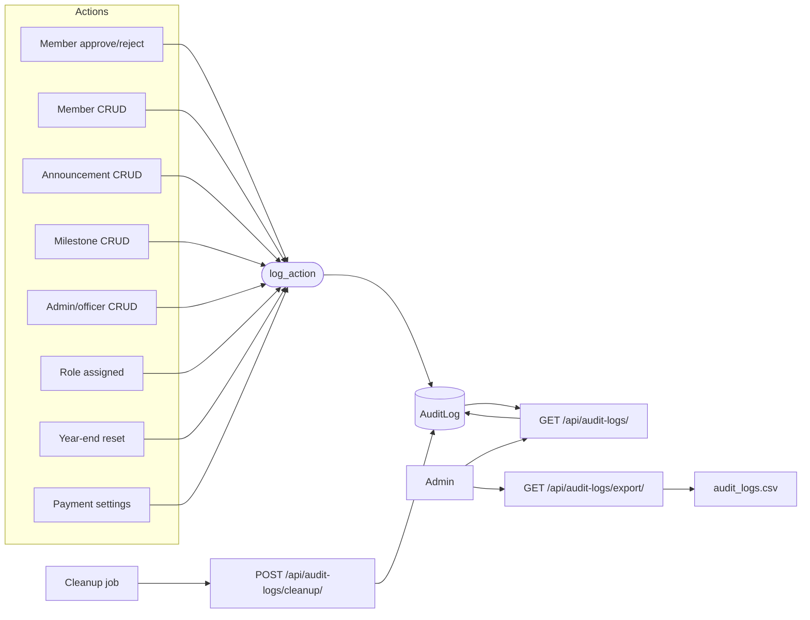

# Audit Logging Flow

## Flowchart

## Step-by-Step

1. Every privileged mutation calls `audit_logs.utils.log_action(user, action_type, entity_type, entity_id, entity_name, details, request)`.
2. `log_action` extracts the client IP from `X-Forwarded-For` (fallback `REMOTE_ADDR`) and **never raises** (errors are swallowed so auditing can't break a request).
3. The row is stored in `AuditLog` with `timestamp` (auto), actor, action type, entity info, JSON `details`, and IP.
4. Admins browse logs via `GET /api/audit-logs/` with filters: `action_type`, `entity_type`, `date_from`, `date_to`, `search`.
5. They can export a CSV via `GET /api/audit-logs/export/` (same filters): columns `Timestamp, Admin Email, Admin Username, Action, Entity Type, Entity Name, Entity ID, Details, IP Address`.
6. `GET /api/audit-logs/stats/?last_visit=` returns `new_logs` + `total_logs` — powers the unread badge in the admin sidebar.
7. Old logs are purged with `POST /api/audit-logs/cleanup/` (older than `AUDIT_LOG_RETENTION_DAYS`, default **90**).

## Logged action types

`MEMBER_APPROVED`, `MEMBER_REJECTED`, `MEMBER_CREATED`, `MEMBER_UPDATED`, `MEMBER_DELETED`, `ROLE_ASSIGNED`, `ADMIN_CREATED`, `ADMIN_UPDATED`, `ADMIN_DELETED`, `MILESTONE_CREATED`, `MILESTONE_UPDATED`, `MILESTONE_DELETED`, `MILESTONE_IMAGE_UPLOADED`, `MILESTONE_IMAGE_DELETED`, `ANNOUNCEMENT_CREATED`, `ANNOUNCEMENT_UPDATED`, `ANNOUNCEMENT_DELETED`, `ANNOUNCEMENT_IMAGE_UPLOADED`, `ANNOUNCEMENT_IMAGE_DELETED`, `ABOUT_SECTION_CREATED`, `ABOUT_SECTION_UPDATED`, `ABOUT_SECTION_DELETED`, `ABOUT_SECTION_REORDERED`, `YEAR_END_RESET`, `PAYMENT_SETTINGS_UPDATED`

(`ROLE_DELEGATED` is declared but the delegation feature was removed.)

## API Endpoints

| Endpoint | Method | Permission | Purpose |
|---|---|---|---|
| `/api/audit-logs/` | GET | IsAdmin | List + filter |
| `/api/audit-logs/export/` | GET | IsAdmin | CSV download |
| `/api/audit-logs/stats/` | GET | IsAdmin | Unread badge stats |
| `/api/audit-logs/cleanup/` | POST | CanManageContent | Purge old logs |

## Related Pages

- [Screens: Admin Logs](/screens/admin-logs)
- [Admin Guide: Audit Logs](/admin-guide/audit-logs)
- [Data Model: AuditLog](/data-model)
