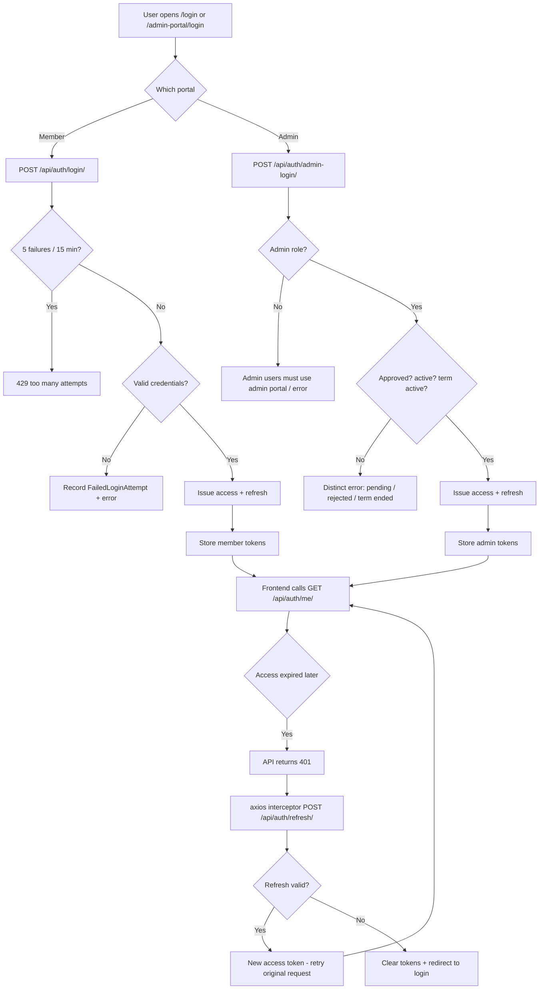

# Auth & Sessions Flow

## Flowchart

## Step-by-Step

1. **Member login** — `POST /api/auth/login/` (AllowAny). Admin-role users are rejected with *"Admin users must use the admin portal login"*.
2. **Admin login** — `POST /api/auth/admin-login/` (AllowAny, 5/15 min). Requires `role='ADMIN'` and returns distinct errors for PENDING / REJECTED / inactive / term-ended (`position='NONE'`).
3. Both issue **access** (15 min) + **refresh** (7 days) JWT tokens.
4. The frontend stores tokens under **separate keys** so member and admin sessions never collide:
   - Member: `member_access_token`, `member_refresh_token`
   - Admin: `admin_access_token`, `admin_refresh_token`
5. Every authed request attaches `Authorization: Bearer <access>`.
6. When the access token expires, the axios response interceptor:
   - Refreshes via `POST /api/auth/refresh/` (rotated; old refresh is blacklisted)
   - Writes the new access token back to the **same session type** that made the request
   - Retries the original request once
   - If refresh fails (or no refresh token exists), clears all tokens and redirects to the role-appropriate login (`/login` or `/admin-portal/login`)
7. Failed logins are tracked per email in `FailedLoginAttempt`; after **5 failures in 15 minutes** the account is blocked (429).

## Failed-attempt protection

| Mechanism | Detail |
|---|---|
| `FailedLoginAttempt` rows | Recorded on every failed login |
| Block window | 5 failures / email / 15 min → HTTP 429 |
| `GET /api/auth/failed-attempts/` | Frontend pre-checks before showing "too many attempts" |
| `django-ratelimit` | Per-IP caps on all auth endpoints |

## API Endpoints

| Endpoint | Method | Permission | Purpose |
|---|---|---|---|
| `/api/auth/login/` | POST | AllowAny | Member login (JWT) |
| `/api/auth/admin-login/` | POST | AllowAny (5/15m) | Admin login (JWT) |
| `/api/auth/refresh/` | POST | AllowAny | Rotate refresh → new access |
| `/api/auth/me/` | GET | IsAuthenticated (5/min) | Current user + membership status |
| `/api/auth/failed-attempts/` | GET | AllowAny (10/min) | Failed-attempt pre-check |
| `/api/auth/change-password/` | POST | IsAuthenticated (5/min) | Password change + blacklist tokens |

## Related Pages

- [Security](/security)
- [Screens: Login](/screens/login)
- [Screens: Admin Login](/screens/admin-login)
- [Flow: Password Reset](/flows/password-reset)
