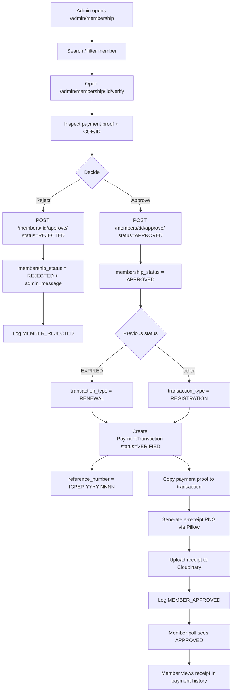

# Member Approval & E-Receipt Flow

## Flowchart

## Step-by-Step

1. An admin with approval access opens the membership list, finds the member, and opens the **Verify** screen (`/admin/membership/:id/verify`).
2. The screen shows the member's **payment proof** and **COE/ID** images (resolved through `VITE_BACKEND_URL`).
3. The admin chooses **Approve** or **Reject**, optionally including a message.
4. **Reject:** the profile's `membership_status` becomes `REJECTED`, the message surfaces to the member via `/me`, and `MEMBER_REJECTED` is logged.
5. **Approve:**
   - `membership_status` → `APPROVED`.
   - A `PaymentTransaction` is auto-created with `status='VERIFIED'` and:
     - `transaction_type = RENEWAL` if the old status was `EXPIRED`, else `REGISTRATION`
     - `reference_number = ICPEP-<year>-<NNNN>` (sequential, generated server-side)
     - `academic_year` from the current academic year (August-based, e.g. `2026-2027`)
     - `approved_by_name` = the approving admin's name
   - The member's `payment_proof_image` is copied onto the transaction.
   - The e-receipt is rendered (`members/receipt_generator.py::generate_receipt_png`) and saved to `transaction.receipt_image`. Receipt generation failure is **non-fatal** (logged as a warning).
   - `MEMBER_APPROVED` is logged with old/new status.
6. The member's 8-second poll flips them to `/member/dashboard`, where the APPROVED status and the receipt appear in **Payment History**.

## E-Receipt Details (`backend/members/receipt_generator.py`)

- Renders an **800×700 PNG** with Pillow.
- Contains: ICPEP navy border, org name, title **"ACKNOWLEDGEMENT RECEIPT"**, reference no., member name, date, transaction type, payment method, status, academic year, optional payment-proof thumbnail (downloaded from the stored URL, ≤ 10s timeout), signature line, and the footer *"This is a system-generated receipt…"*.
- Font fallback: DejaVu Sans → Liberation → Windows Arial → default bitmap.

## API Endpoints

| Endpoint | Method | Permission | Purpose |
|---|---|---|---|
| `/api/members/<pk>/approve/` | POST | CanManageMembership | Approve/reject + generate transaction/receipt |
| `/api/members/<pk>/` | GET | owner-or-admin | Load verify screen data |
| `/api/members/transactions/` | GET | IsAuthenticated | Member views own receipts |

## Related Pages

- [Screens: Admin Membership Verify](/screens/admin-membership-verify)
- [Flow: Payments & Receipts](/flows/payments-receipts)
- [Data Model](/data-model)
