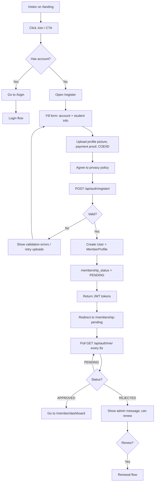

# Member Registration Flow

## Flowchart

## Step-by-Step

1. A visitor opens the landing page and clicks **Join** (or any CTA).
2. If they already have an account they go to `/login`; otherwise they open `/register`.
3. The registration form collects:
   - **Account info:** email, username, password, confirm password
   - **Student info:** first/middle/last name, student number (`XXXX-XXXXX`), course, year level (1–4), section (A/B/C/D suggestions), contact number (11 digits, starts `09`)
   - **Documents:** profile picture, payment proof, COE/ID image (all ≤ 10 MB; COE/ID allows JPG/PNG/PDF)
4. On submit, the frontend POSTs `/api/auth/register/` (rate-limited 5/min per IP). Uploads are retried up to 2 times with a 5s delay on failure.
5. The backend `RegisterSerializer.create()` creates the `User` **and** the `MemberProfile` in one shot; `membership_status` defaults to `PENDING`.
6. JWT access + refresh tokens are returned immediately — the member can log in and see the **PENDING** state.
7. The frontend redirects to `/membership-pending`, which **polls `GET /api/auth/me/` every 8 seconds**.
8. When an admin approves (see [Approval & Receipt](/flows/member-approval-receipt)), the poll flips the member to `/member/dashboard`.
9. If rejected, the member sees the admin's message and may renew (see [Renewal](/flows/member-renewal)).

## API Endpoints

| Endpoint | Method | Permission | Purpose |
|---|---|---|---|
| `/api/auth/register/` | POST | AllowAny (5/min) | Create user + profile |
| `/api/auth/availability/` | GET | AllowAny (5/min) | Check email/username before submit |
| `/api/auth/me/` | GET | IsAuthenticated (5/min) | Poll membership status |

## Notes

- Registration does **not** set an explicit role → the user gets the model default; the frontend treats it as a member.
- There is **no email** sent on registration or approval — only audit logs and (on approval) an e-receipt.
- File uploads retry silently to tolerate flaky uploads.

## Related Pages

- [Screens: Register](/screens/register)
- [Screens: Membership Pending](/screens/membership-pending)
- [Flow: Member Approval & Receipt](/flows/member-approval-receipt)
- [Flow: Member Renewal](/flows/member-renewal)
