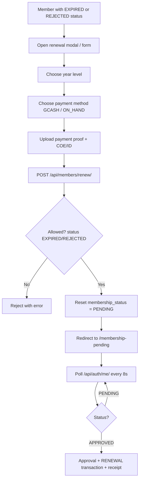

# Member Renewal Flow

## Flowchart

## Step-by-Step

1. A member whose `membership_status` is `EXPIRED` (or `REJECTED`) triggers renewal from the pending page (or their profile).
2. They choose a **year level**, a **payment method** (GCash is the default), and upload both **payment proof** and **COE/ID** images.
3. The frontend POSTs `/api/members/renew/` (owner-only, IsAuthenticated).
4. The backend allows the request **only** when the current status is `EXPIRED` or `REJECTED` (both image uploads are required).
5. The profile's status resets to **PENDING**, and the member returns to the pending-waiting screen (8-second poll).
6. On admin approval, the same approval machinery runs, but the transaction type is **RENEWAL** (see [Approval & Receipt](/flows/member-approval-receipt)).

## Admin side: Bulk operations

| Endpoint | Method | Permission | Purpose |
|---|---|---|---|
| `/api/members/renew-all/` | POST | CanManageMembership | Sets **all** APPROVED members → EXPIRED (year-end sweep) |
| `/api/users/admins/year-end-reset/` | POST | President only | Expires all members **and** resets non-President officers to `position='NONE'` |

> ⚠️ These are **destructive** operations intended only for the year-end transition. See [Year-End Reset](/flows/year-end-reset).

## API Endpoints

| Endpoint | Method | Permission | Purpose |
|---|---|---|---|
| `/api/members/renew/` | POST | IsAuthenticated (owner) | Submit renewal → PENDING |
| `/api/members/renew-all/` | POST | CanManageMembership | Expire all members (admin bulk) |
| `/api/users/admins/year-end-reset/` | POST | President | Full year-end reset |

## Related Pages

- [Screens: Membership Pending](/screens/membership-pending)
- [Flow: Member Approval & E-Receipt](/flows/member-approval-receipt)
- [Flow: Year-End Reset](/flows/year-end-reset)
