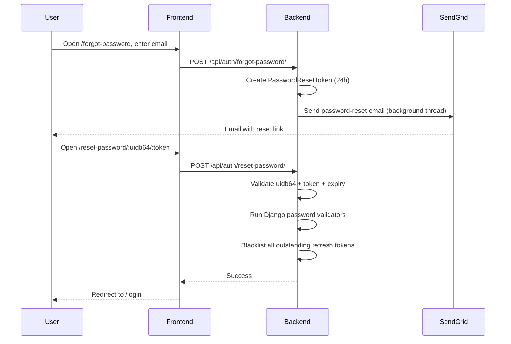

# Password Reset Flow

## Flowchart

## Step-by-Step

1. The user opens `/forgot-password` and submits their email.
2. `POST /api/auth/forgot-password/` (AllowAny, 5/min) creates a `PasswordResetToken` (`secrets.token_urlsafe(48)`, 24h expiry).
3. The backend builds `<FRONTEND_URL>/reset-password/<uidb64>/<token>` and sends it via **SendGrid** in a **daemon background thread** (the HTTP request is not blocked).
4. If `SENDGRID_API_KEY` is not configured, it falls back to Django's SMTP `send_mail` (settings `EMAIL_*`).
5. The user opens the emailed link, sets a new password, and submits `POST /api/auth/reset-password/`.
6. The backend validates uidb64 + token + unused + not-expired (24h), runs Django's password validators, and **blacklists all outstanding refresh tokens** for the user (forcing re-login everywhere).
7. The user logs in again.

## Frontend details

- `ResetPassword.jsx` reads `uidb64`/`token` from the URL params and handles the `already_used` case and per-token error lists.
- Forgot-password reads the email from search params to prefill.
- Both forms retry up to 2 times on upload failure.

## API Endpoints

| Endpoint | Method | Permission | Purpose |
|---|---|---|---|
| `/api/auth/forgot-password/` | POST | AllowAny (5/min) | Create token + email reset link |
| `/api/auth/reset-password/` | POST | AllowAny (5/min) | Validate token, set new password |
| `/api/auth/change-password/` | POST | IsAuthenticated (5/min) | Change while logged in |

## Related Pages

- [Security](/security)
- [Screens: Forgot Password](/screens/login)
- [Flow: Auth & Sessions](/flows/auth-session)
- [Technology Stack (SendGrid)](/technology-stack)
