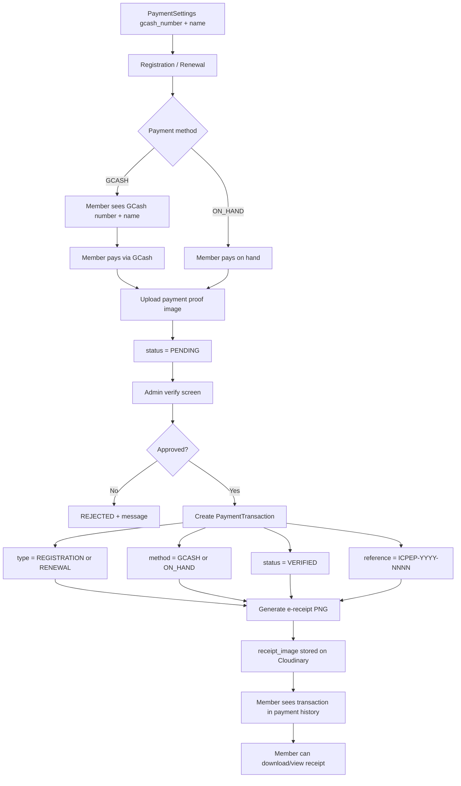

# Payments & E-Receipts Flow

## Flowchart

## Step-by-Step

1. The GCash number and GCash name shown to members are configured once by the admin (President/Treasurer) via `PATCH /api/members/payment-settings/`.
2. A member registering or renewing chooses **GCash** (default) or **ON_HAND**, pays, and uploads the payment proof image.
3. The transaction's initial state is **PENDING** until an admin approves the membership.
4. On approval, a verified `PaymentTransaction` is created (see [Approval & E-Receipt](/flows/member-approval-receipt)) and an e-receipt PNG is auto-generated and stored.
5. The member views the transaction + receipt under **Payment History** (`/api/members/transactions/`).

## Payment Settings

| Field | Description |
|---|---|
| `gcash_number` | GCash number displayed during payment |
| `gcash_name` | Name attached to the GCash account |

Only users with `has_payment_access` (President / Finance / Treasurer) can update these.

## Data

`PaymentTransaction` — see [Data Model](/data-model):

- `transaction_type`: `REGISTRATION` | `RENEWAL`
- `payment_method`: `ON_HAND` | `GCASH`
- `status`: `PENDING` | `VERIFIED`
- `reference_number`: `ICPEP-YYYY-NNNN` (unique)
- `receipt_image`: auto-generated on approval

## API Endpoints

| Endpoint | Method | Permission | Purpose |
|---|---|---|---|
| `/api/members/payment-settings/` | GET | AllowAny | Fetch GCash info |
| `/api/members/payment-settings/` | PATCH | President/Treasurer | Update GCash info |
| `/api/members/transactions/` | GET | IsAuthenticated | List own (or all, admin) transactions |

## Related Pages

- [Flow: Member Approval & E-Receipt](/flows/member-approval-receipt)
- [Flow: Member Renewal](/flows/member-renewal)
- [User Guide: Payments](/user-guide/payments)
- [Screens: Admin Dashboard (GCash settings)](/screens/admin-dashboard)
