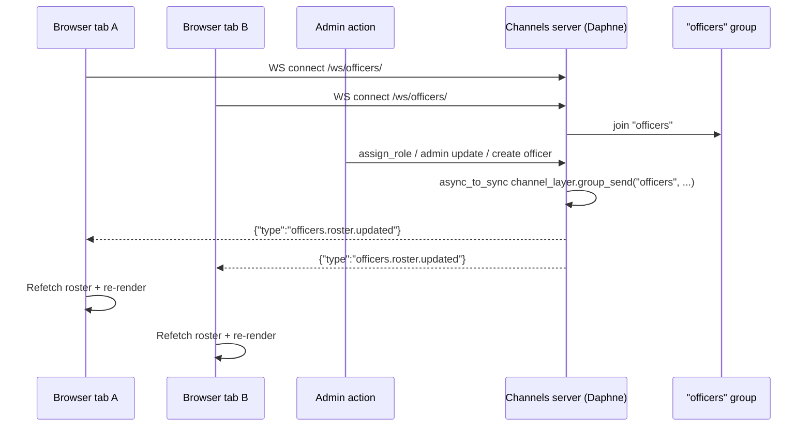

# Realtime WebSockets Flow

## Flowchart

## Step-by-Step

1. The frontend's `OfficersProvider` opens a WebSocket at `VITE_WS_URL` (or `/ws/officers/`).
2. `OfficersConsumer` (an `AsyncWebsocketConsumer`) accepts the connection and joins the group `"officers"` on every open tab.
3. When an admin performs a roster-affecting action — **admin delete, admin update, assign-role, or create officer** — the backend calls `async_to_sync(channel_layer.group_send)("officers", ...)` with payload `{ "updated_by": <user id> }`.
4. Every connected tab receives `officers.roster.updated` and refetches the public roster (`GET /api/users/officers/roster/`), updating the carousel/roster UI live.
5. Broadcast failures are wrapped in try/except so realtime problems never break the HTTP request.

## Configuration

| Setting | Value |
|---|---|
| Routing | `config/asgi.py` → `AuthMiddlewareStack(URLRouter(users.routing.websocket_urlpatterns))` |
| Consumer | `users/consumers.py::OfficersConsumer` (broadcast-only) |
| Channel layer | `channels.layers.InMemoryChannelLayer` (dev default) |
| Production | `channels_redis` + `REDIS_URL` are installed/available; not currently wired |

> **Note:** `InMemoryChannelLayer` only works within a **single process**. On Render (single daphne process) this is fine. If the backend ever scales to multiple instances, switch the channel layer to Redis (`channels_redis`) using `REDIS_URL`.

## API Endpoints

| Endpoint | Type | Purpose |
|---|---|---|
| `ws://<host>/ws/officers/` | WebSocket | Receive roster-update broadcasts |
| `/api/users/officers/roster/` | GET (AllowAny) | Public leadership board data |

## Related Pages

- [Technology Stack](/technology-stack)
- [Screens: Member About (OfficersCarousel)](/screens/member-about)
- [Screens: Landing](/screens/landing)
