# Year-End Reset Flow

## Flowchart

```mermaid
flowchart TD
    A[New academic year begins] --> B{Which reset?}
    B -- Members only --> C[Admin POST /api/members/renew-all/]
    B -- Full reset --> D[President POST /api/users/admins/year-end-reset/]
    C --> E[All APPROVED members -> EXPIRED]
    E --> F[Log YEAR_END_RESET type=members_expired]
    D --> G[All APPROVED members -> EXPIRED]
    G --> H[All non-President officers: position=NONE, term_start=None]
    H --> I[Log YEAR_END_RESET type=full_reset]
    F --> J[Members must renew to stay active]
    I --> J
```

## Step-by-Step

### Members-only sweep (`POST /api/members/renew-all/`)

1. Any admin with membership access expires **all** `APPROVED` members → `EXPIRED`.
2. Logs `YEAR_END_RESET` (`type: members_expired`).
3. Expired members must go through the [Renewal flow](/flows/member-renewal) to become active again.

### Full reset (`POST /api/users/admins/year-end-reset/`)

1. **President only.**
2. Expires all APPROVED members (same as above).
3. Resets every non-President admin/officer: `position='NONE'`, `term_start=None`.
4. Logs `YEAR_END_RESET` (`type: full_reset`).

> ⚠️ **Destructive.** These operations cannot be undone. Run only during the planned year-end transition, and confirm with the current President before executing.

## Purpose

The portal tracks memberships on an **academic-year basis**. The year-end reset is the canonical way to:

- Force every member to renew (and pay again) each academic year.
- Clear out officer terms so the new set of officers must be re-appointed (via role assignment / access requests).

## API Endpoints

| Endpoint | Method | Permission | Purpose |
|---|---|---|---|
| `/api/members/renew-all/` | POST | CanManageMembership | Expire all members |
| `/api/users/admins/year-end-reset/` | POST | President only | Expire members + reset officer terms |

## Related Pages

- [Flow: Member Renewal](/flows/member-renewal)
- [Maintenance & Handover](/maintenance-handover)
- [Data Model: status enums](/data-model)
