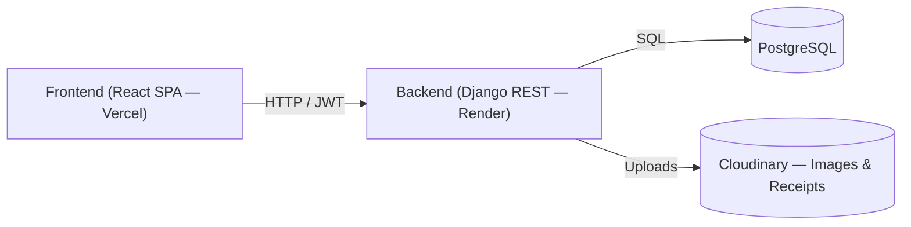

---
title: Overview
description: What is the ICPEP Portal and how it works
---

# Overview

The **ICPEP Portal** is a membership management system built for the **Institute of Computer Engineers of the Philippines (ICPEP)** chapter. It handles the full lifecycle of member registration, approval, renewal, payment tracking, and e-receipt generation.

## Purpose

Replace manual paper-based membership processing with a streamlined digital workflow:

- **Members** register online, submit proof of payment, view digital ID cards, and access their payment history
- **Officers** manage membership approvals, announcements, and chapter administration
- **Admins** control the entire system with role-based access and audit trails

## Key Features

| Feature | Description |
|---|---|
| **Membership Management** | Register, approve, renew, and track members |
| **E-Receipts** | Auto-generated PNG receipts on admin approval |
| **Payment Tracking** | GCash or on-hand payments with proof upload |
| **Announcements** | Create, pin, publish, and mark as members-only |
| **Officer ID Cards** | Digital ID cards with QR codes and roles |
| **Audit Logs** | Full activity trail with CSV export |
| **Role-Based Access** | FULL_CONTROL, MEMBERSHIP, RESTRICTED access levels |

## System Architecture

> See [System Architecture](/architecture) and [Technology Stack](/technology-stack) for the full diagram and detailed stack.

## Intended Users

- **Chapter Members** — Students who register and maintain membership
- **Chapter Officers** — Handle day-to-day membership operations
- **System Administrators** — Full system management and configuration

## Technology Stack

| Layer | Technology |
|---|---|
| Frontend | React 19, Vite, Tailwind CSS |
| Backend | Django 5.2, Django REST Framework, Channels |
| Database | PostgreSQL (Render) |
| Storage | Cloudinary (images, receipts) |
| Auth | JWT (access 15m + refresh 7d, rotation + blacklist) |
| Push | pywebpush (VAPID, aes128gcm) |
| Deployment | Render (backend), Vercel (frontend) |

> Full version details and rationale: [Technology Stack](/technology-stack).
